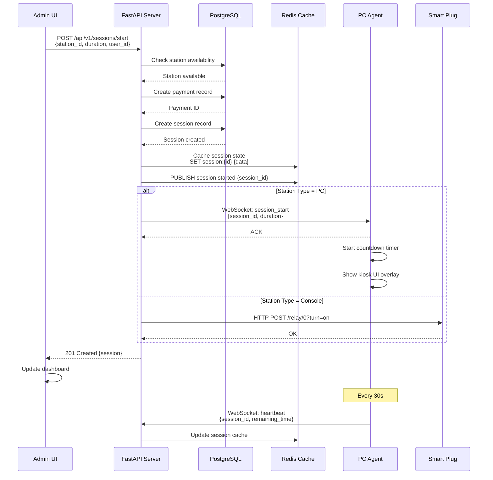
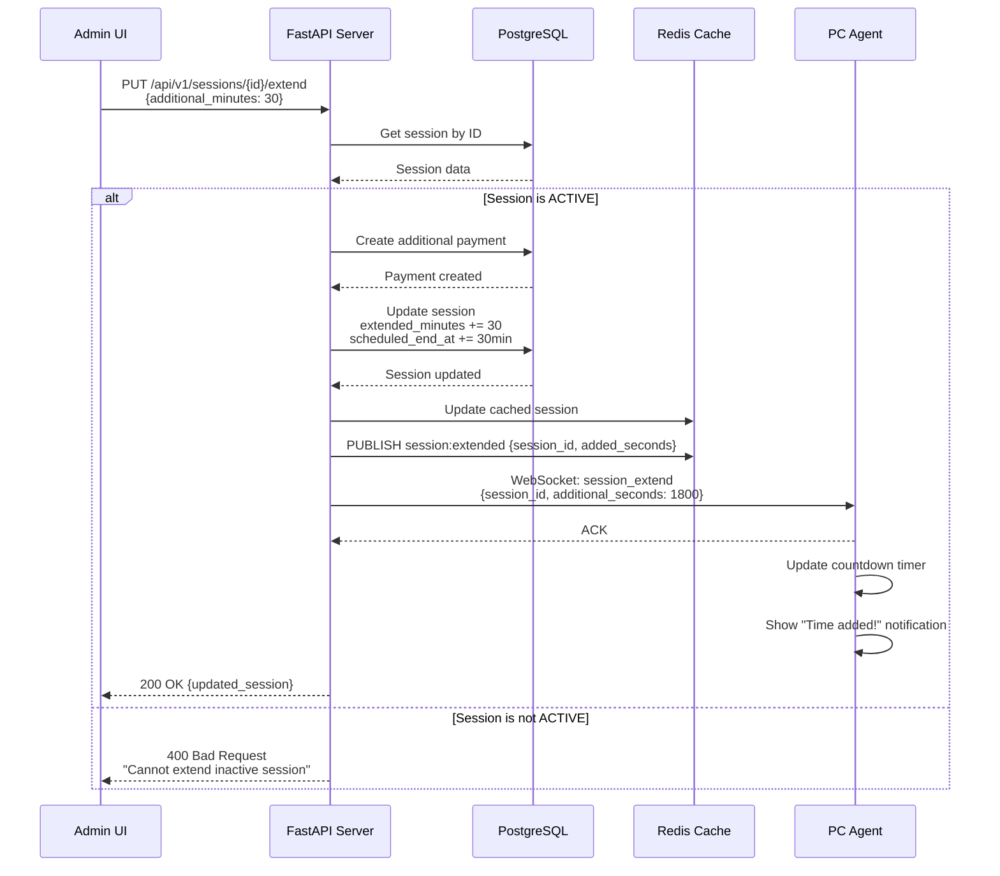
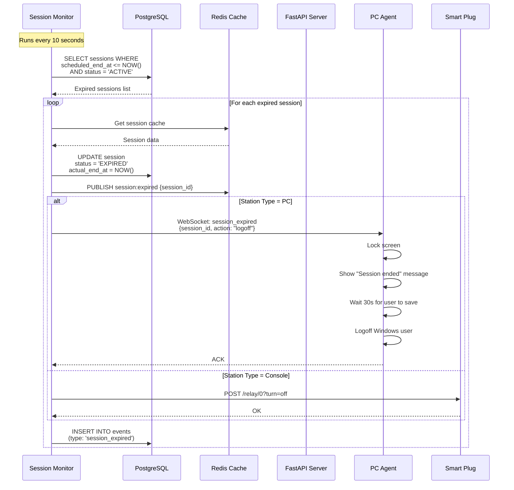
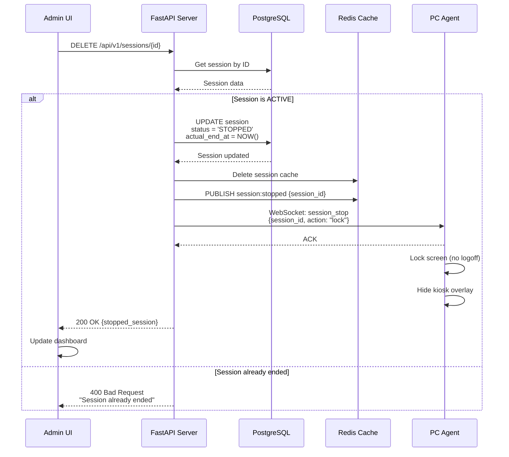
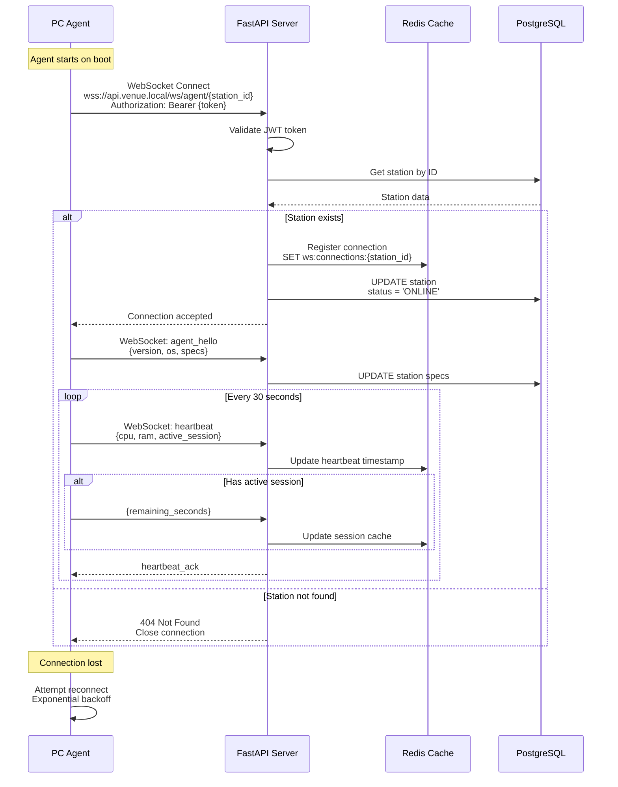
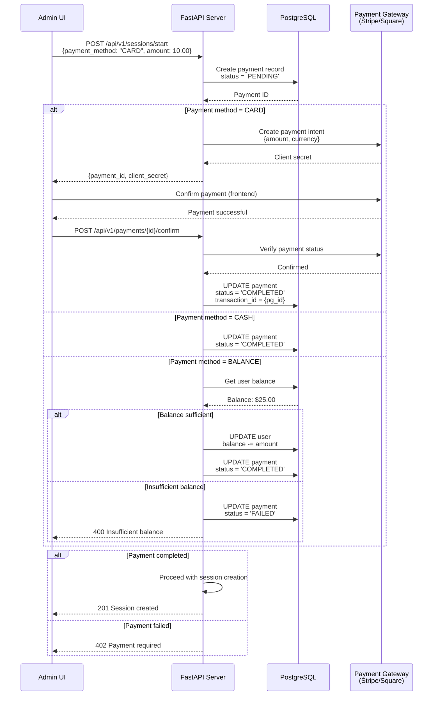
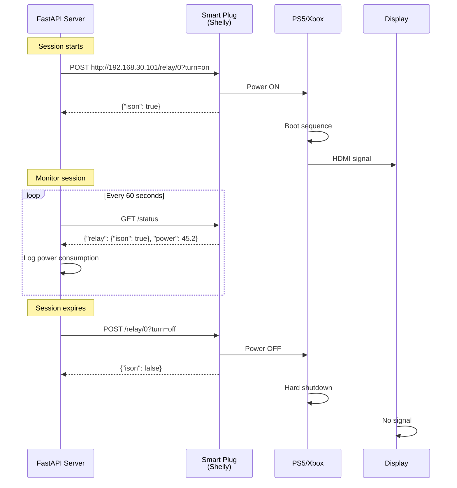
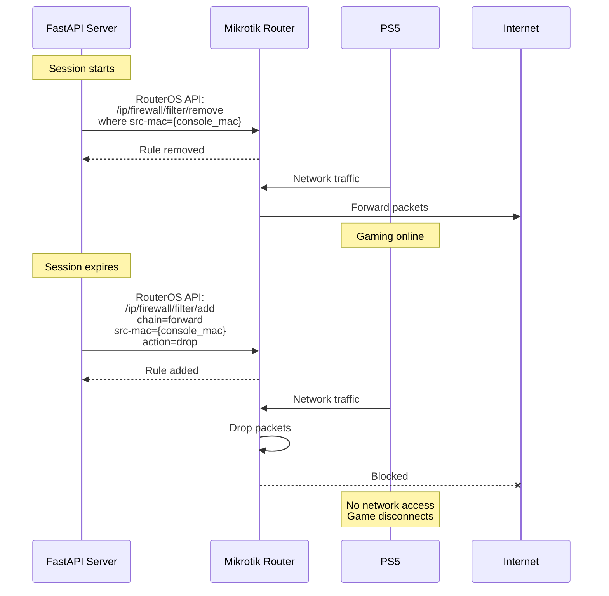
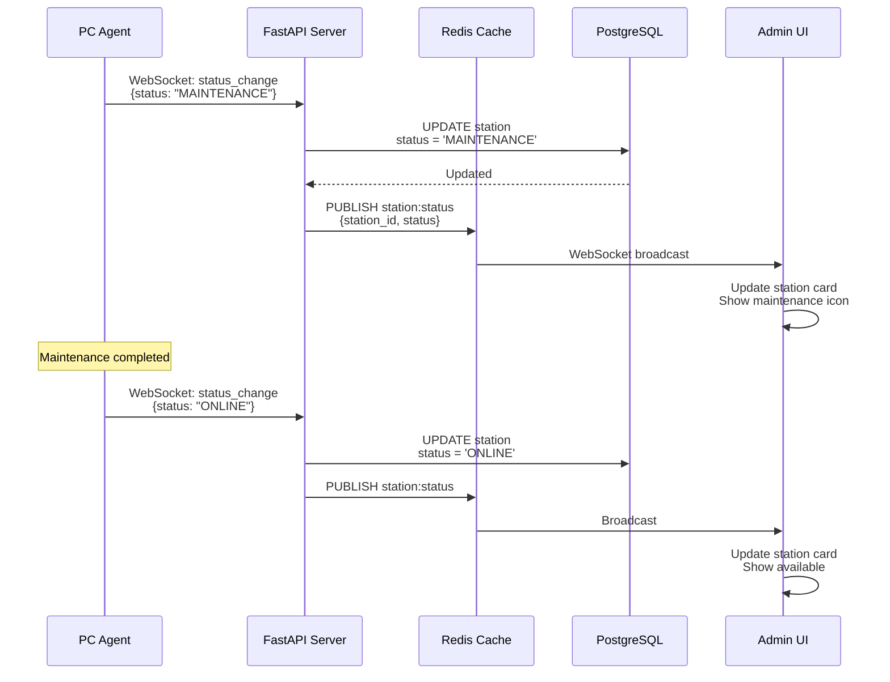
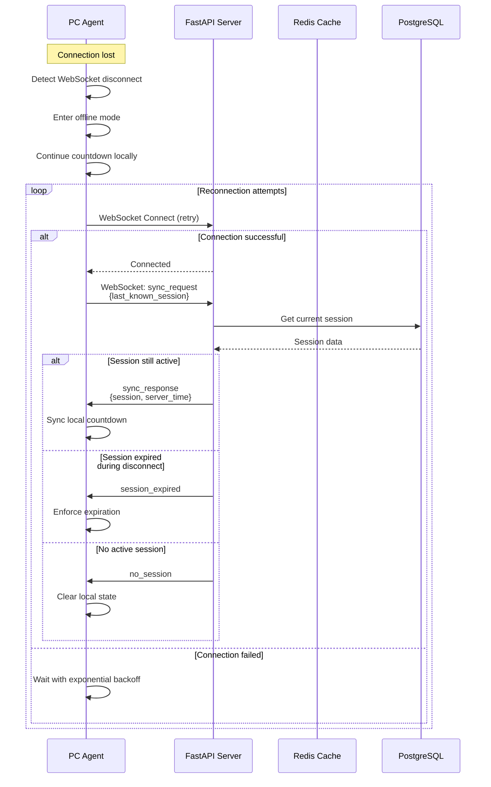

# Sequence Diagrams - Session Lifecycle

## 1. Session Start Flow

---

## 2. Session Extension Flow

---

## 3. Session Expiration Flow

---

## 4. Session Stop (Manual) Flow

---

## 5. Agent Connection & Heartbeat Flow

---

## 6. Payment Processing Flow

---

## 7. Console Station Control Flow (Smart Plug)

---

## 8. Network-Based Console Control (Router API)

---

## 9. Station Status Update Flow

---

## 10. Error Handling & Recovery

---

## Next: Database Schema & Deployment Plans
